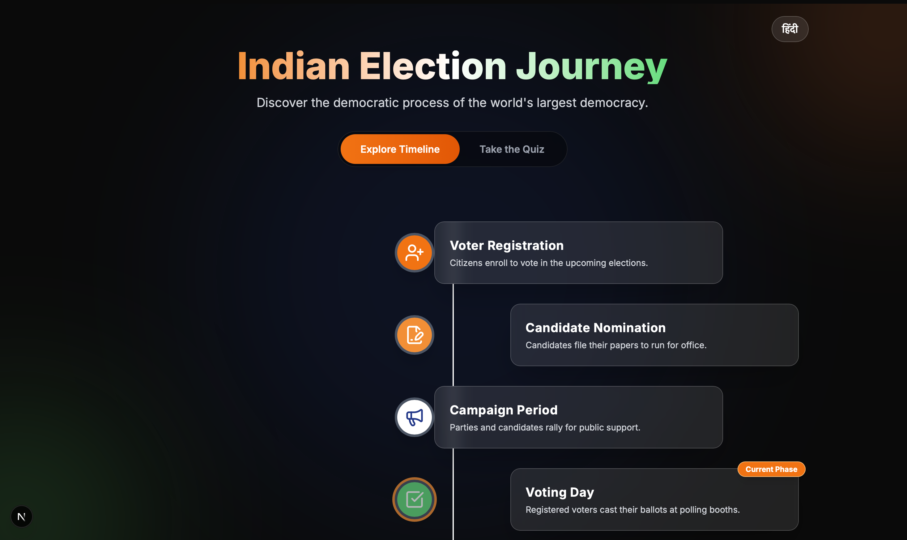
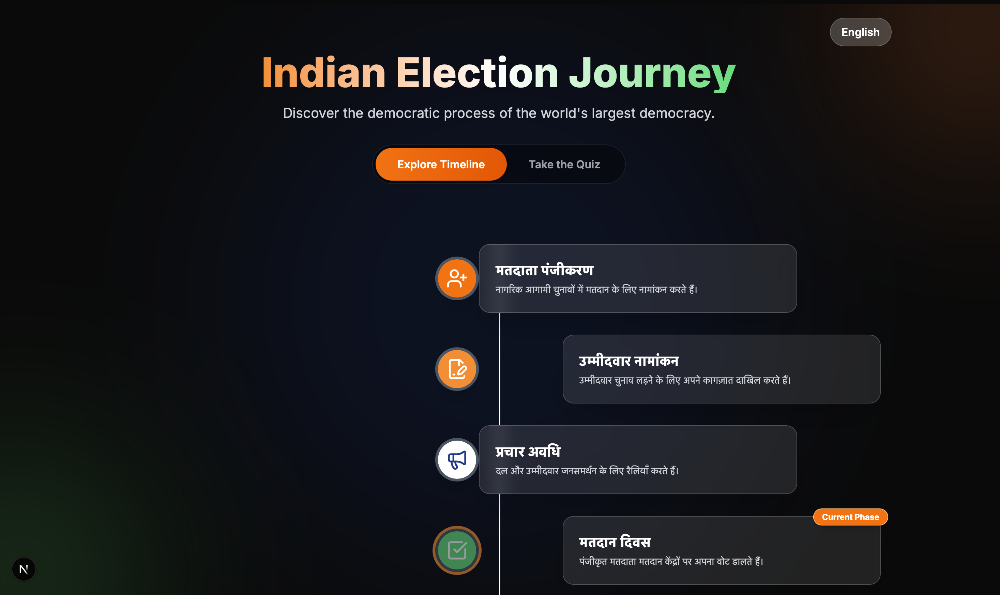
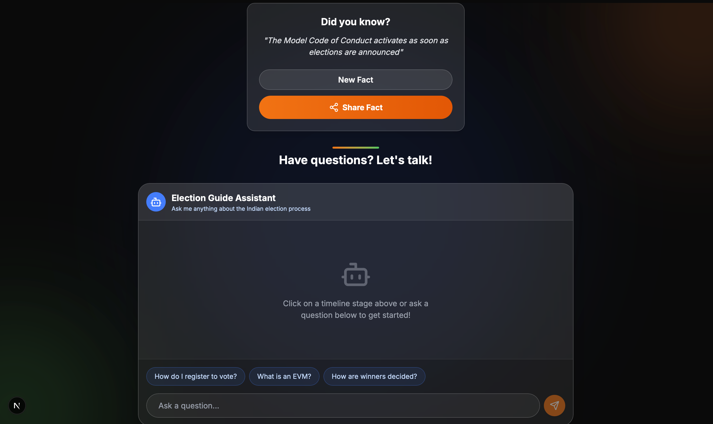

# 🇮🇳 Indian Election Journey App

A comprehensive, bilingual (English & Hindi) interactive web application designed to educate users about the Indian election process. This project is proudly submitted for **PromptWars Virtual by Google**.

<div align="center">
  
</div>

## 🚀 Features

*   **🌍 Bilingual Support (English & Hindi):** Seamlessly toggle between English and Hindi across the entire application, including UI elements, timeline content, and AI chatbot responses.
*   **📅 Interactive Election Timeline:** Explore the multi-phase Indian election process through a dynamic, responsive timeline that adapts to both mobile and desktop views.
*   **🤖 AI-Powered Chatbot:** Ask questions about the elections and get instant, context-aware answers powered by Google's **Gemini AI**. The chatbot understands and responds in both English and Hindi.
*   **🧠 Dynamic AI Quiz:** Test your knowledge with an interactive quiz that generates questions dynamically using Gemini via a dedicated Next.js API route.
*   **📱 Mobile-First & Accessible:** Built with intuitive touch interactions (`react-swipeable`), ensuring a flawless experience on smartphones and tablets.
*   **📸 Shareable Content:** Easily capture and share your quiz results or interesting election facts with friends using the integrated image capture feature.

## 📸 Screenshots

Here is a glimpse of the application in action:

| English Interface | Hindi Interface | AI Chatbot |
| :---: | :---: | :---: |
|  |  |  |

## 🛠️ Technology Stack

*   **Framework:** [Next.js 16](https://nextjs.org/) (App Router)
*   **UI Library:** [React 19](https://react.dev/)
*   **Styling:** [Tailwind CSS v4](https://tailwindcss.com/)
*   **AI Integration:** [`@google/genai`](https://www.npmjs.com/package/@google/genai) (Google Gemini API)
*   **Icons:** [Lucide React](https://lucide.dev/)
*   **Interactions:** `react-swipeable`
*   **Utilities:** `html-to-image`

## ⚙️ Getting Started

Follow these steps to run the application locally:

### Prerequisites
*   Node.js (v20 or higher)
*   npm or yarn
*   A valid Google Gemini API Key

### Installation

1.  **Navigate to the project directory:**
    ```bash
    cd Prompt_Wars_C_2
    ```

2.  **Install dependencies:**
    ```bash
    npm install
    ```

3.  **Set up environment variables:**
    Make sure you have a `.env.local` file in the root directory and add your Gemini API key:
    ```env
    GEMINI_API_KEY=your_api_key_here
    ```

4.  **Run the development server:**
    ```bash
    npm run dev
    ```

5.  **Open your browser:**
    Navigate to [http://localhost:3000](http://localhost:3000) to explore the app!

## 🤖 Built with Antigravity

This application was developed in collaboration with **Antigravity**, Google Deepmind's advanced agentic coding assistant. The project structure highlights modern best practices guided by AI-assisted development:

*   **Clean Next.js App Router Structure:** A well-organized `src/app` directory that separates layouts (`layout.tsx`), pages (`page.tsx`), and global styles (`globals.css`) for seamless, modern routing.
*   **Modular Components:** Reusable, single-responsibility UI elements strategically located in `src/components`, ensuring a highly maintainable and scalable codebase.
*   **Decoupled API Logic:** Dedicated serverless API routes (e.g., `src/app/api/quiz/route.ts`) that securely interface with the Google Gemini SDK without exposing keys to the client.
*   **Integrated AI Workflows:** Efficient use of generative AI not just for features (Chatbot, Quiz), but as a pair-programming partner to rapidly iterate on complex state management like the global English/Hindi language toggle.

## 💡 About PromptWars Virtual

This project was built for **PromptWars Virtual by Google** to showcase the power of generative AI in educational technology. It demonstrates how complex topics like national elections can be made accessible, engaging, and interactive using modern web frameworks, the Gemini API, and cutting-edge agentic development.

---
*Built with ❤️ using Antigravity for Google PromptWars Virtual*
